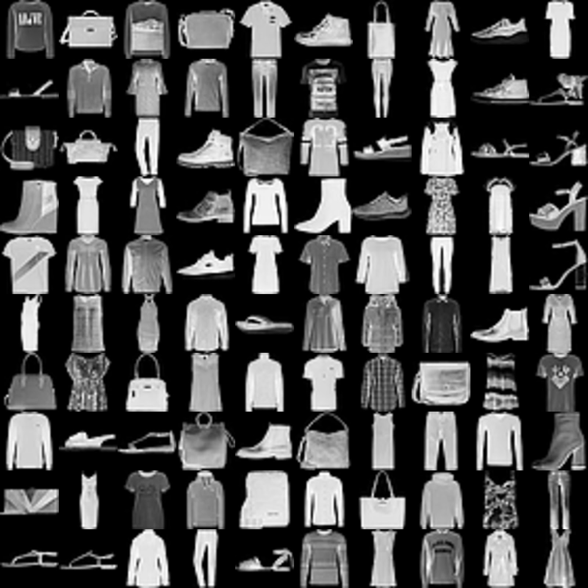

# Classification on FashionMNIST
Implementation of deep learning methods to classify FashionMNIST dataset

## Introduction
This is a small project where I implement deep learning method on classification on FashionMNIST dataset. The codes is wirtten in PyTorch.
In this project, I design three different model structures, and experiment results acn be found under logs/ folder. The main goal is to check whether **Residaul block** used in ResNet is useful or not even when the model is small. 

## FashionMNIST
This is a dataset contains 10 kinds of object. Fortunately, this dataset can be accessed direcrtly with PyTorch.


**FashionMNIST**

> NOTE: To download this dataset for the first time, add the parameter "download = True" in line 26, 27 in main.py. Set to "False" after downloaded.

## Usage

**Traning**
```
python3 main.py train <model name> \
-lr <Learning rate> \
-batch_size <Batch size> \ 
-epoch_num  <Epoch number> \
-save <Name of weights to be saved> \ 
-log  <File name for recoding>
```
> Read script.sh for an example, and read main.py for more information
